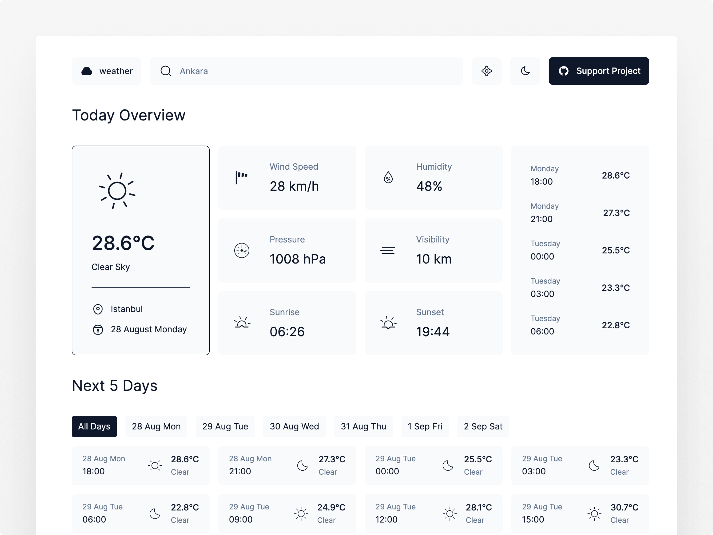

# Realtime Weather Website

This project is a real-time weather application built using React.js and deployed on Vercel. It lets users instantly check weather conditions for various locations worldwide, providing a seamless experience to stay informed about current weather updates.

# Key Features: 

1. Realtime Weather Updates: The application provides users with current weather conditions such as temperature, humidity, wind speed, and detailed weather descriptions for any specified location. Additionally, it includes a forecast for the upcoming days, showcasing high and low temperatures and expected weather conditions.

2. OpenWeatherMap API Integration: Leveraging the OpenWeatherMap API ensures that the application fetches accurate and up-to-date weather data. This API not only supplies current weather information but also forecasts and weather alerts, enhancing the reliability of weather updates.

3. Geolocation Support: By utilizing the browser's Geolocation API, the application automatically detects and displays weather information based on the user's current location. This feature eliminates the need for users to manually input their location, providing instant weather updates tailored to their whereabouts.

4. Search Functionality: Users can easily search for weather information by entering city names, zip codes, or specific geographic coordinates. This flexibility allows users to retrieve weather data for any desired location worldwide, enhancing accessibility and usability.
>

5. Minimalistic and Responsive Design: The application boasts a clean and intuitive user interface designed for ease of use. Its minimalistic design focuses on presenting essential weather information in a visually appealing manner. Moreover, the design is fully responsive, ensuring seamless functionality and optimal user experience across various devices, including desktops, tablets, and mobile phones.

6. Error Handling and Fast Performance: Robust error handling mechanisms are implemented to gracefully manage API request failures or invalid user inputs. This ensures that users receive informative feedback and maintain uninterrupted access to weather updates. The application is built with Next.js, a framework known for efficient page rendering and fast loading times, enhancing overall performance and user satisfaction.

# Tech Stack:

Frontend:

<ul>
<li>Client-side Framework: Next.js (a React-based framework for building server-rendered, statically generated, and performance-optimized websites)</li>
<li>Programming Language: JavaScript (with TypeScript)</li>
<li>UI Library: None (uses native HTML and CSS for styling)</li>
<li>State Management: Redux (Next.js uses a similar approach for state management)</li>
<li>CSS Preprocessor: None (uses native CSS)</li>
</ul>

Backend/Server-side:

<ul>
<li>Server-side Framework: Next.js (handles server-side rendering and API routes)</li>
<li>API Integration: Integrates with OpenWeatherMap API to fetch up-to-date weather data based on user queries.</li>
<li>Database: None (uses OpenWeatherMap API for data storage and retrieval)</li>
</ul>

Deployment:

<ul>
<li>Platform: Deployed on Vercel, optimized for serverless deployments of frontend applications, ensuring high availability and fast loading times globally.</li>
<li>Build Tool: Webpack (bundled with Next.js)</li>
<li>Package Manager: npm (Node Package Manager)</li>
</ul>

Other:

<ul>
<li>Geolocation API: Browser's geolocation API for fetching the user's location.</li>
<li>Weather Icons and Graphics: Custom icons and graphics used to visually represent weather conditions on the application.</li>
</ul>
